# Lab8Web
# Praktikum 8 PHP dan Database Mysql
Langkah-langkah Praktikum
1. Siapkan Vscode
2. Buat folder lab8_php_database di local Disk C/xampp/htdocs
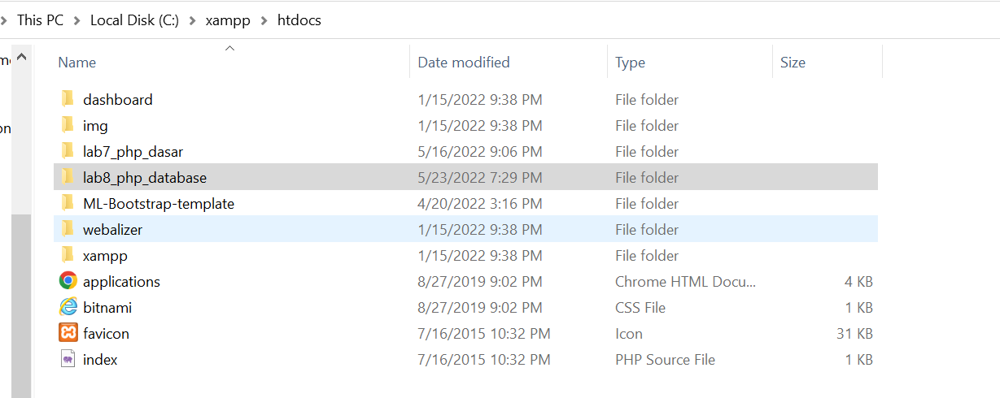
3. Buka xampp , kemudian start Apache dan Mysql
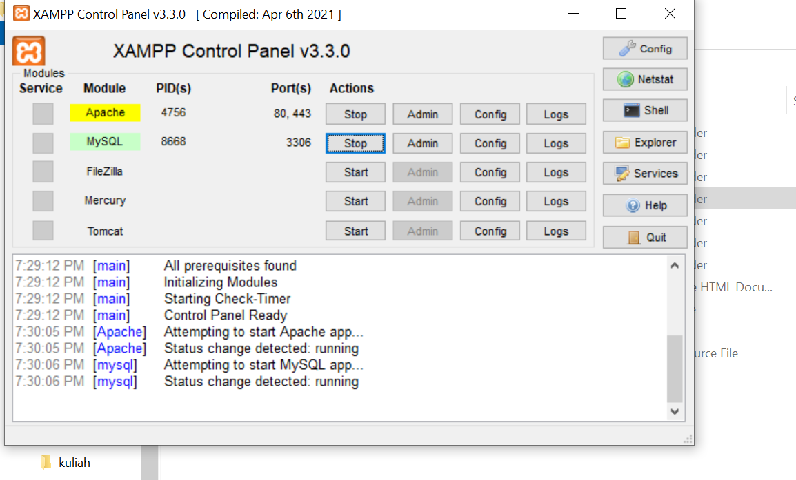
4. Buka chrome dan akses http://localhost/phpmyadmin
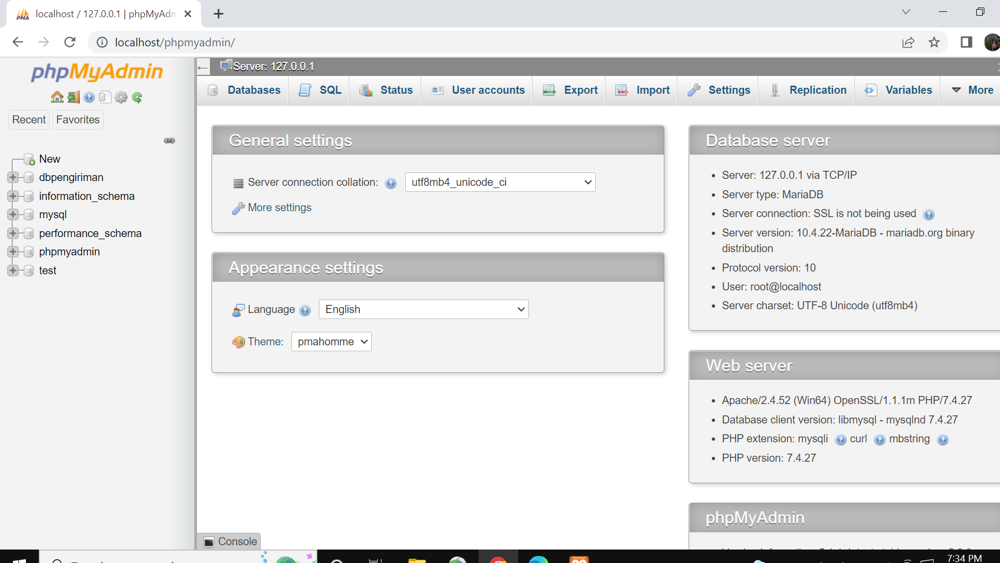
5. Create New Database dengan nama latihan1
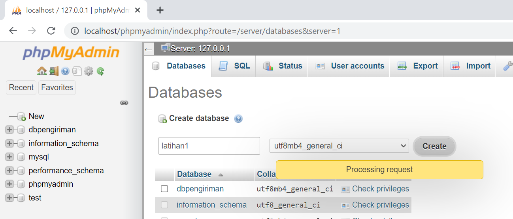
6. Akses juga localhost/lab8_php_database
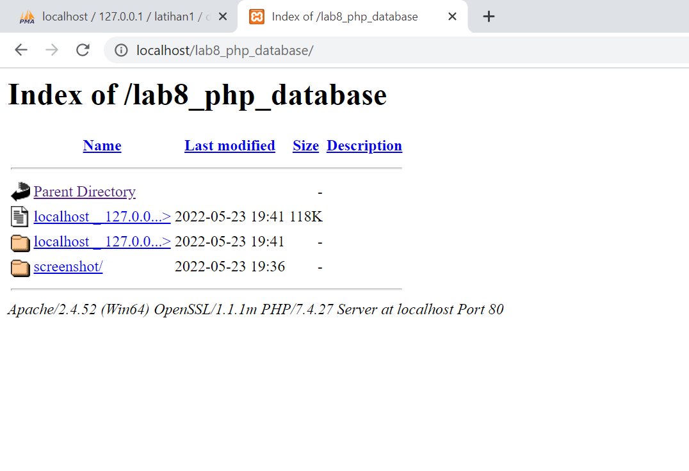
7. Buka vscode, new file>beri nama file dengan nama koneksi.php siman di c/xampp/lab8_php_database
isi dengan source code dibawah ini:
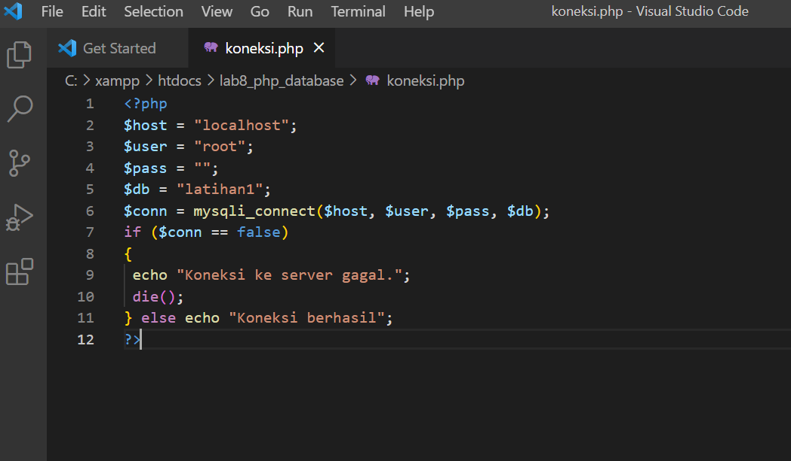
save , untuk melihat hasilnya akses http://localhost/lab8_php_database/koneksi.php
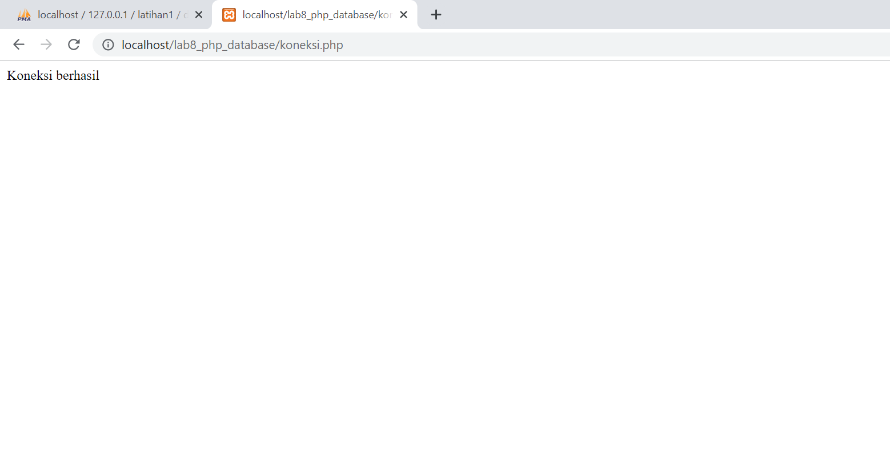
8. Masih di vscode, buat new file dengan nama index.php di lokasi file yang sama, kemudian isi dengan source code seperti dibawah ini:
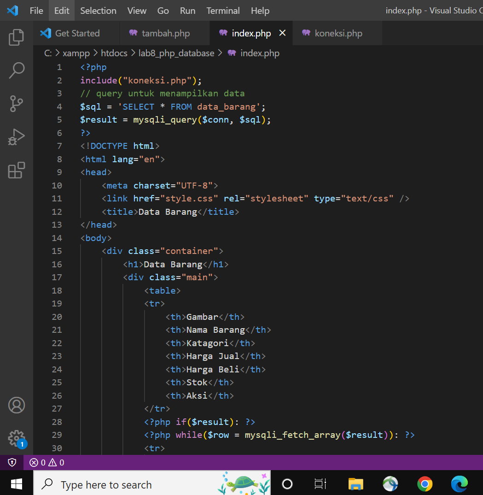
refresh http://localhost/lab8_php_database/
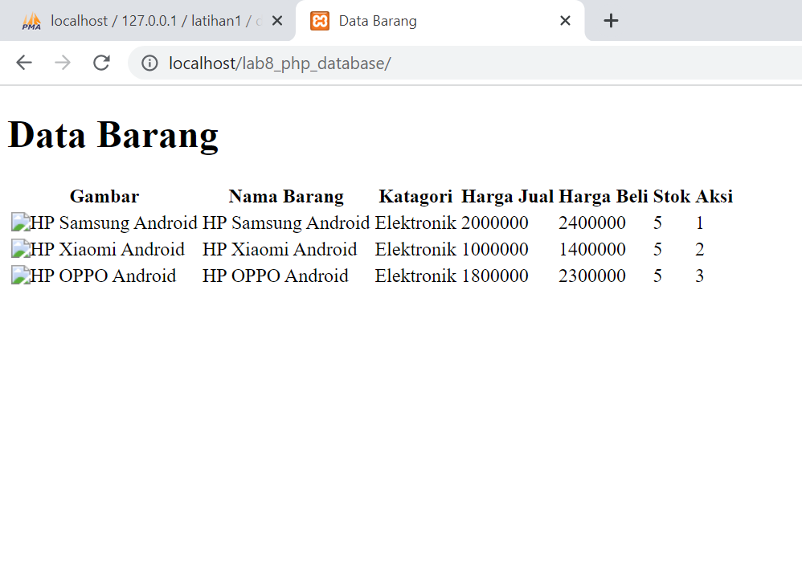
9. Program tambah barang, buat new file dengan nama tambah.php
akses http://localhost/lab8_php_database/tambah.php
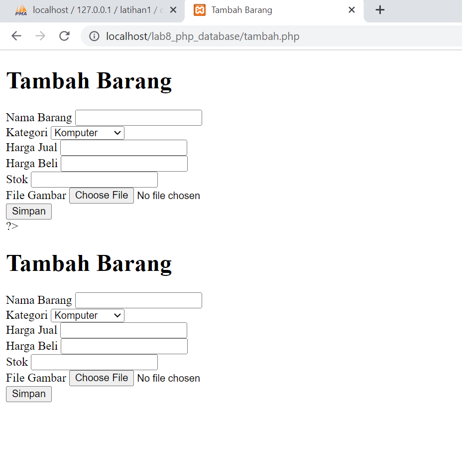
10. program hapus
buat  new file, dengan mana hapus.php
dan isi dengan source code dibawah ini
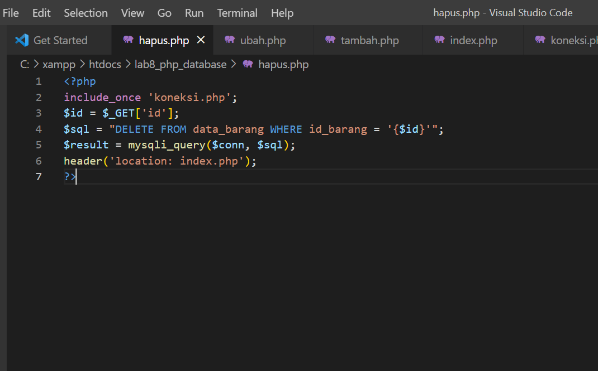